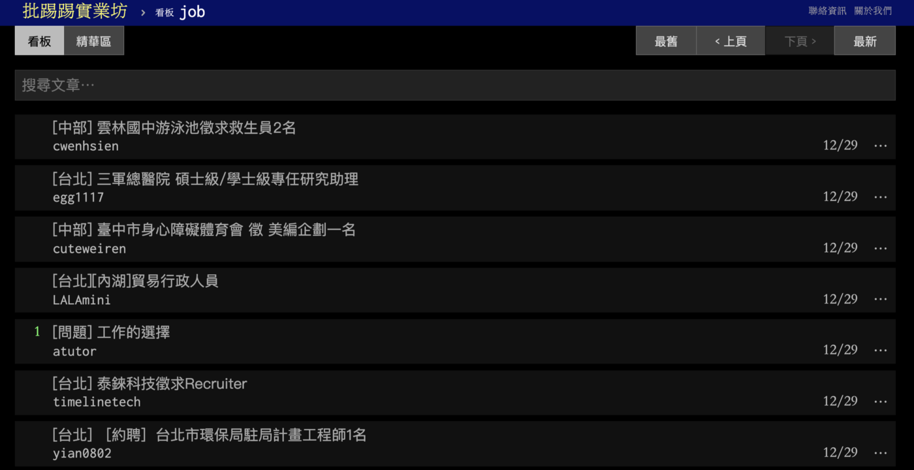

### 什麼是網路爬蟲呢？讓我們來一探究竟!

<!--more-->


在撰寫爬蟲之前先來建議一些基礎觀念。

首先，什麼是網路爬蟲呢？
根據 Wikipedia 的定義，網路爬蟲是一種用來自動瀏覽全球資訊網的網路機器人。 
簡單來說，所謂的網路爬蟲就是一個從網路上自動抓取資料的程式。

**在我們眼中的網站：**



**在爬蟲眼中的網站：**


### **那網路時如何運作的呢？**

網頁是由客戶端發出請求(request)，再由伺服器端回應(response)。而兩端之間使用 HTTP 來進行溝通。詳細地說，客戶端主要負責向伺服器端請求(request)資源，並將資源組合成頁面呈現給使用者；而伺服器端負責回應(response)客戶端的請求，再根據請求回應相對應的資源。

此外，網頁又是如何構成的呢？

網頁主要就是由 HTML 來組織成網頁的內容，再由 CSS 來設計網頁的外觀，最後由 JavaScript 來串連網頁的行為。

在網路爬蟲的時候就會根據你所指定的規則來搜尋 HTML 標籤，常用的篩選規則有標籤、 class 以及 id 。class 是一種標籤可以套用的類別，可以將多個 HTML 標籤加上同一個類別來定義他們的樣式，而 id 是一種唯一的識別碼，在一個 HTML 中，id 只能使用一次，也就是只能有一個標籤套用這個 id。篇幅有限就不多介紹，有興趣可以去了解 HTML 和網頁的作用(´・ω・`)。

下面是有關 CSS 選擇器的遊戲練習，有興趣可以玩看看！

[CSS Diner](https://flukeout.github.io/)


### 有了基本的網頁觀念之後，接著我們來介紹 Python！

對於Python來說，所有東西都是物件。在我們撰寫Python時常常會引入前人已經寫好的套件(package)來簡化我們的程式碼，我們這章節所用到的 requests 就是一個套件。不過，當我們在 from bs4 import BeautifulSoup 的時候，會從 bs4 引進 BeautifulSoup，這是因為當某些套件內容太龐大時，我們可以從指定的目錄去引進特定的一部分的程式。

```python
import requests
from bs4 import BeautifulSoup
```

Python的套件管理工具中，集合了下載、安裝、升級、管理、移除套件等功能，我們可透過pip下載PyPI的套件，PyPI是Python的第三方套件集中地，目前搜集了超過五萬個第三方套件。這裡我們就不介紹詳細介紹各種套件。

在網路爬蟲中，我們會透過 requests 向網頁法送請求並接收回應。我們來看看 Python 的 requests 套件溜~

### Python requests 語法小教室

可以模擬各種網路請求。如：get、post、put、delete。下面會分別介紹requests 的 get 及 post 請求。

**最常見的就是 get 請求。**
普通單純的網頁，只需要用最簡單的 GET 請求就可以直接下載。在使用 requests.get 的時候，我們可以創一個 response (下面簡稱resp)變數來存我們 get 到的資料，用法如下：

```python
url = '網址'
resp = requests.get(url)
```

接著我們就可以從 ptt 的網址中，取得我們要的資料，為了方便我們之後爬取不同頁面，我們將網址分成網域及網頁路徑兩個部分。

```python
base_url = "https://www.ptt.cc"  ＃ ptt 的網域
job_page = "/bbs/job/index.html" ＃ ptt 的網頁路徑
resp = requests.get(base_url + job_page)
```

若遇到需要帳號密碼登入的網頁時，我們就要加上 auth=(‘user’,’pass’)參數

```python
# 需要帳號密碼登入的網頁：
resp = requests.get(‘網址',auth=('user', 'pass'))
```

另外來介紹一下，requests 的 post 請求。在網頁中，如果有讓使用者填入資料的表單，大部分都會需要 post 請求來處理，主要的用法如下：

```python
my_data = {'key1':'value1','key2':'value2'} # 資料
resp = requests.post('網址',data = my_data) # 將資料丟入 post 請求中

# 若遇到重複鍵值(key)的 HTML 表單欄位：
my_data = (('key1':'value1'),('key':'value2'))
resp = requests.post('網址',data = my_data)

# 若要上傳檔案
myfile = {'my_filename':open('my_file.docx','rb')}
resp = request.post('網址',files = myfile)
```

在我們使用 requests 有時會遇到逾時或不合格憑證的問題，下面提供簡單的解決方法給大家參考：

### 1.逾時

等待逾時是指伺服器無回應的狀態下所等待的時間，如果遇到這種狀況，可以設定 timeout 等於你要等待的時間，若過了你所設定等待的時間則放棄：

```python
resp = request.get('網址',timeout = 3) # 等待 3 秒，無回應則放棄
```

### 2.不合格憑證

若自架網頁伺服器的網站，HTTPS 常有憑證不合格的問題，遇到這種狀況時，只要把 verify 關起來就可以囉：

```python
resp = request.get('網址',verify = False) # 關閉憑證查驗
```

這次的入門篇就介紹到這邊，下次我們再來講 BeautifulSoup 套件，以及更詳細的 PTT 網路爬蟲實作，帶大家用 Python 爬取 PTT 咯！

## **結語**

希望這篇教學能幫助正在入門爬蟲的你，也希望能幫助想將程式變成第二外語的你們(´・ω・`)/ 喜歡的話給我小小的掌聲，我會很開心的噢！